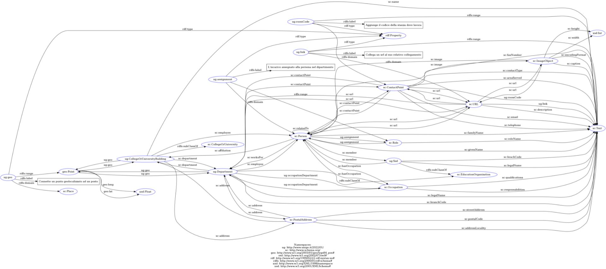

# Installazione del server Virtuoso di Unige per la gestione dei linked data

## Tabella del contenuto

* [Introduzione](#introduzione)
* [Problema affrontato](#problema-affrontato)
* [Installazione tool per utilizzare la macchina virtuale](#installazione-tool-per-utilizzare-la-macchina-virtuale)
* [Installazione tools per utilizzare Virtuoso](#installazione-tools-per-utilizzare-virtuoso)
    * [Configurazione del repository](#configurazione-del-repository)
    * [Installazione di Docker Engine](#installazione-di-docker-engine)
    * [Installazione container Docker di Virtuoso](#installazione-container-docker-di-virtuoso)
* [Utilizzo di Virtuoso](#utilizzo-di-virtuoso)
    * [Configurazione del database](#configurazione-del-database)
    * [Inserimento dei linked data nel database](#inserimento-dei-linked-data-nel-database)
* [Ontologia di Unige](#ontologia-di-unige)
* [Organizzazione dei files](#organizzazione-dei-files)
    * [Creator](#creator)
    * [Ontology](#ontology)
    * [Queries](#queries)
    * [Virtuoso](#virtuoso)

## Introduzione

In questo progetto affronto la realizzazione di un database semantico per Unige, riportando una banca dati di linked data relativi agli edifici e ai dipartimenti delle università di Genova. Lo scopo è quello di installare un server permanente che contenga i dati semantici e dell API che, se richiamate, restituiscano i dati ricercati.

## Problema affrontato

Per utilizzare questo database di linked data, ho utilizzato come server Virtuoso Universal Server, ovvero un database ibrido che utilizza le funzionalità di un tradizionale sistema di gestione di database relazionali (RDBMS), database relazionale a oggetti (ORDBMS), database virtuale, RDF, XML, testo libero, server di applicazioni web e file server di funzionalità in un unico sistema.

Per utilizzarlo mi sono appoggiato ad una macchina remota con installato come SO Linux, collegandomi tramite SSH e un browser embedded tramite l'utilizzo di MobaXTerm.

Per la parte di creazione dei linked data da usare come dati per il database e per le API, ho utilizzato degli script Python creati tramite Visual Studio Code.

Per dettagli maggiori su ogni singola parte, consultare i capitoli successivi.

## Installazione tool per utilizzare la macchina virtuale

Per questo progetto è stata installata una macchina virtuale in Unige con sistema operativo Linux Ubuntu Focal, release 20.04 LTS, con memoria disco di circa 32 GB e RAM di circa 8 GB. Per collegarmi alla macchina ho usato il tool [MobaXTerm](https://mobaxterm.mobatek.net/), un toolbox per remote computing dove in una sola applicazione si possono utilizzare dei tools di remote network, browser SFTP, ecc.

Si suppone inizialmente che ci si possa collegare alla rete della macchina remota, in caso ci si trovasse esternamente basta installare come tool la VPN [GlobalProtect](https://globalprotect.updatestar.com/it) e collegarsi con i propri username e password.

Dopo averlo scaricato e installato ci troveremo davanti alla schermata successiva, nella quale avremo a disposizione differenti funzionalità, ma quella principale che ci interessa e la parte "Session" (inquadrato di verde nell'immagine).


Aprendo questa sezione avremo la possibilità di aggiungere una sessione che rimarrà salvata all'interno. Particolarmente a noi interessano le seguenti:

1) Sessione di remote network (SSH).

2) Sessione di trasferimento e manipolazione dei dati (SFTP).

3) Sessione di embedded browser (Browser).


Partendo dalla sessione SSH, basta crearla e impostare l'indirizzo della macchina (nel mio caso è stata impostata a 130.251.22.225) e lasciare impostata la porta a 22. Non necessariamente si deve specificare un utente, ma si potrebbe impostare e salvare all'interno del tool per non doverlo chiedere ogni volta che ci si connette.


In seguito si crea una sessione SFTP, non necessaria ma che ci agevola nell'inserimento dei files remoti e nella loro modifica. Per farlo basta seguire gli stessi passaggi fatti per la sessione SSH.


Come ultima parte, basta configurare l'embedded browser che ci servirà per gestire la parte di UI di Virtuoso. Basta creare una sessione browser e impostare l'url al quale vogliamo connetterci. In questo caso dipende dall'installazione di Virtuoso fatta, nel mio caso (come si può vedere nell'immagine successiva) ho utilizzato lo stesso indirizzo IP precedente e configurato il servizio di Virtuoso UI alla porta 8890 (se si seguono successivamente i passi fatti da me, allora si può configurare così).


A questo punto è stato configurato tutto il necessario per potersi connettere alla macchina virtuale, ora bisognerà configurarla per poter utilizzare tutti i tool necessari per Virtuoso.

## Installazione tools per utilizzare Virtuoso

Per l'utilizzo di Virtuoso sulla macchina remota bisogna [installare Docker Engine](https://docs.docker.com/engine/install/ubuntu/) e in seguito creare il [container per Virtuoso](https://hub.docker.com/r/openlink/virtuoso-closedsource-8), in seguito vengono descritti tutti i passi fatti.

N.B.: tutti i passaggi successivi per l'installazione sono fatti tramite la sessione SSH della macchina virtuale configurata.

### Configurazione del repository

Per l'installazione di Docker Engine, si inizia aggiornando l'indice del pacchetto apt e installando i paccherri per consentire ad apt di un repositori tramite HTTPS:

```sh
$ sudo apt-get update
```

```sh
$ sudo apt-get install \
    ca-certificates \
    curl \
    gnupg \
    lsb-release
```

In seguito si deve aggiungere la chiave GPG ufficiale di Docker:

```sh
$ curl -fsSL https://download.docker.com/linux/ubuntu/gpg | sudo gpg --dearmor -o /usr/share/keyrings/docker-archive-keyring.gpg
```

Si deve utilizzare il comando seguente per configurare il repository stable. Per aggiungere il repository **nightly** o **test**, si deve aggiungere la parola `nightly` o `test` (o entrambi) dopo la parola `stable` nei comandi seguenti.

```sh
$ echo \
    "deb [arch=$(dpkg --print-architecture) signed-by=/usr/share/keyrings/docker-archive-keyring.gpg] https://download.docker.com/linux/ubuntu \
    $(lsb_release -cs) stable" | sudo tee /etc/apt/sources.list.d/docker.list > /dev/null
```

### Installazione di Docker Engine

Inizialmente si aggiorna l'indice del pacchetto apt e si installa l'ultima versione di Docker Engine e di containerd, oppure si può andare al passaggio successivo per installare una versione specifica:

```sh
$ sudo apt-get update
```

```sh
$ sudo apt-get install docker-ce docker-ce-cli containerd.io
```

Se si vuole installare una versione specifica di Docker Engine:

- Si elencano tutte le versioni disponibili nel repository.

    ```sh
    $ apt-cache madison docker-ce
    ```

- Quindi si seleziona e installa uno dei risultati precedenti, utilizzando la `version string` dalla seconda colonna, ad esempio `5:18.09.1~3-0~ubuntu-xenial`.

    ```sh
    $ sudo apt-get install docker-ce=<VERSION_STRING> docker-ce-cli=<VERSION_STRING> containerd.io
    ```

- Infine si verifica se Docker Engine è stato installato correttamente eseguendo l'immagine `hello-world`.

    ```sh
    $ sudo docker run hello-world
    ```

    Questo comando scarica un'immagine di prova e la esegue in un contenitore. Quando il contenitore viene eseguito, stampa un messaggio ed esce.

Arrivati a questo punto, Docker Engine è stato installato ed è funzionante. Il gruppo Docker viene creato ma non vi vengono aggiunti utenti. Si deve usare `sudo` per eseguire i comandi Docker.

Il daemon Docker si collega a un socket Unix anziché a una porta TCP. Per impostazione predefinita, quel socket Unix è di proprietà dell'utente `root` e altri utenti possono accedervi solo utilizzando `sudo`. Il demone Docker viene sempre eseguito come utente `root`.

Se non si vuole anteporre `sudo` al comando `docker`, si deve creare un gruppo Unix chiamato `docker` ed si aggiungono utenti ad esso. All'avvio, il daemon Docker crea un socket Unix accessibile dai membri del gruppo `docker`.

Quindi per creare il gruppo `docker` e aggiungere un utente, basta seguire i seguenti passaggi:

- Creare il gruppo Docker.

    ```sh
    $ sudo groupadd docker
    ```

- Aggiungere il proprio utente al gruppo `docker`.

    ```sh
    $ sudo usermod -aG docker $USER
    ```

- Uscire ed accedere nuovamente in modo che l'appartenenza al tuo gruppo venga rivalutata.

    Dato che si esegue il test su una macchina virtuale, potrebbe essere necessario riavviare la macchina virtuale per rendere effettive le modifiche.

    In un ambiente Linux desktop come X Windows, disconnettersi completamente dalla sessione e quindi accedere nuovamente.

    Su Linux, si può anche eseguire il seguente comando per attivare le modifiche ai gruppi:

    ```sh
    $ newgrp docker
    ```

- Si verifica di poter eseguire i comandi `docker` senza l'utilizzo di `sudo`.

    ```sh
    $ docker run hello-world
    ```

    Se inizialmente si sono eseguiti i comandi Docker CLI utilizzando `sudo` prima di aggiungere l'utente al gruppo `docker`, si potrebbe visualizzare il seguente errore, che indica che la propria directory `~/.docker/` è stata creata con autorizzazioni errate a causa dei comandi `sudo`.

    ```
    WARNING: Error loading config file: /home/user/.docker/config.json -
    stat /home/user/.docker/config.json: permission denied
    ```

    Per risolvere questo problema, basta rimuovere la directory `~/.docker/` (viene ricreata automaticamente, ma tutte le impostazioni personalizzate vengono perse) oppure modificarne la proprietà e le autorizzazioni utilizzando i seguenti comandi:

    ```sh
    $ sudo chown "$USER":"$USER" /home/"$USER"/.docker -R
    ```

    ```sh
    $ sudo chmod g+rwx "$HOME/.docker" -R
    ```

La maggior parte delle attuali distribuzioni Linux (RHEL, CentOS, Fedora, Debian, Ubuntu 16.04 e versioni successive) utilizzano `systemd` per gestire quali servizi vengono avviati all'avvio del sistema. Quindi se si vuole configurare che Docker si esegua automaticamente all'avvio, il servizio Docker è configurato per eseguirsi all'avvio per impostazione predefinita. Per avviare automaticamente Docker e Containerd all'avvio per altre distribuzioni, bisogna utilizzare i comandi seguenti:

```sh
$ sudo systemctl enable docker.service
```

```sh
$ sudo systemctl enable containerd.service
```

Per disabilitare questo comportamento, basta utilizzare invece `disable`.

```sh
$ sudo systemctl disable docker.service
```

```sh
$ sudo systemctl disable containerd.service
```

### Installazione container Docker di Virtuoso

Per installare Virtuoso come container di Docker, si seguono i passaggi successivi. Per questa parte si suppone che si siano seguiti tutti i passaggi precedenti, compreso nel non utilizzo di `sudo` nei commandi.

Si fa il download dell'immagine, trasferendo l'ultima immagine Docker di Virtuoso 8.3 sul proprio sistema locale, utilizzando il commando seguente:

```sh
$ docker pull openlink/virtuoso-closedsource-8
```

Per verificare la versione del binary Virtuoso, si può usare il seguente comando:

```sh
$ docker run openlink/virtuoso-closedsource-8 version
```

A questo punto si può creare un'istanza di Virtuoso, più precisamente ora si potrà creare l'istanza per gestire l'installazione di una istanza del db di Unige. Non è necessario impostare tutti i dati come in questa guida, ma può essere customizzata a seconda della propria scelta, comunque vengono elencati successivamente tutti i passaggi fatti per poter modificare a propria scelta i parametri di input.

Si eseguono i seguenti comandi per creare l'istanza Unige di Vituoso sulla macchina virtuale:

```sh
$ mkdir unige_virtdb
```

```sh
$ cd unige_virtdb
```

```sh
$ docker run \
    --name unige_virtdb \
    --interactive \
    --tty \
    --env DBA_PASSWORD=dba \
    --publish 1111:1111 \
    --publish  8890:8890 \
    --volume `pwd`:/database \
    openlink/virtuoso-closedsource-8:latest
```

Questi passaggi creeranno un nuovo database Virtuoso nella sottodirectory `unige_virtdb` e avvierà un'istanza Virtuoso con il server HTTP in ascolto sulla porta `8890` e il server di dati ODBC / JDBC / ADO.Net / OLE-DB / ISQL in ascolto sulla porta `1111`.

L'immagine docker è in esecuzione in foreground (con `-i` o `--interactive`), così si può vedere tutto quello che farà.

Ora si è in grado di contattare il server HTTP Virtuoso utilizzando il seguente URL:

```sh
http://localhost:8890/
```

La parte di connessione a Virtuoso viene descritta nei dettagli in seguito.

## Utilizzo di Virtuoso

Per utilizzare Virtuoso bisogna avere la possibilità di accederci da UI, quindi tramite l'utilizzo di un browser. Come già raccontato nell'ultima parte del capitolo "[Installazione tool per utilizzare la macchina virtuale](#installazione-tool-per-utilizzare-la-macchina-virtuale)", è stato configurato un browser embedded allo stesso URL del server HTTP di Virtuoso, come configurato nell'ultima parte di "[Installazione container Docker di Virtuoso](#installazione-container-docker-di-virtuoso)" , quindi basterà aprire una sessione da MobaXTerm e cliccando su quella creata per il browser, come si può vedere dall'immagine successiva, si arriverà alla schermata principale di Virtuoso.


Le due sezioni principali di Virtuoso sono le seguenti:
- `Conductor`: gestione del database di Virtuoso e delle configurazioni e delle opzioni. Utilizzeremo questa parte per configurare il database inserendo i linked data di Unige creati esternamente.
- `SPARQL endpoint`: endpoint dove si possono richiamare le query SPARQL sul database. Questa sezione non è utile al nostro fine, se non solo per testare le query sul database.

#### Configurazione del database

Per prima cosa bisogna configurare il database per utilizzare i linked data in nostro possesso. Quindi partendo dalla pagina principale di Virtuso, si clicca su `Conductor` ed entrando nella nuova sezione non si potrà eseguire nulla finchè non si accede all'interno del sistema con delle credenziali (come si vede nell'immagine successiva).


Nella sezione in alto a sinistra ci si potrà loggare (nella zona evidenziata in rosso nell'immagine precedente) utilizzando come account `dba` (di default inserito nel sistema) e come password quella inserita nella configurazione del container Docker di Virtuoso (nel nostro esempio la password sarà anch'essa `dba`). A questo punto si potrà accedere a tutti tab presenti nella parte centrale, per le funzionalità a noi interessate cliccheremo su "Web Application Service" per aprire un editor del contenuto dei dati dell'application server, come si vede nell'immagine successiva.


I pulsanti nell'editor sono facilmente comprensibili, ma quelli a noi più interessanti sono i seguenti:

- `Refresh`: si aggiorna la pagina, in caso di operazioni esterne non viene fatto automaticamente.
- `Up`: si torna allo spazio precedente a quello dove ci si trova.
- `New Folder`: si crea una cartella definita nel path in cui ci si trova.
- `Delete`: si rimuove tutto ciò che è selezionato.
- `Properties`: si aprono le proprietà degli elementi selezionati.
- `Upload`: si carica un file esterno al sistema all'interno.

A questo punto per iniziare a creare il database dobbiamo creare la locazione in cui si troveranno i linked data, quindi si preme su `New Folder` per arrivare nella schermata presentata successivamente.


In questa schermata sono stati già selezionati i valori che ci interessano, ma alla creazione non si troveranno tutti questi già impostati. Principalmente i dati a noi interessati che dobbiamo impostare sono:

- `Folder name`: nome della cartella, nel nostro caso la nomineremo `Unige`.
- `Folder type`: tipo della cartella, è necessario configurarla con il valore `Linked Data Import`.
- `Owner`: proprietario della cartella, che dobbiamo selezionare come l'utente che utilizziamo, nel nostro caso sarà `dba`. E' importante settare nel modo giusto questa opzione per non incorrere in problematiche di modifica.
- `Group`: gruppo della cartella, che possiamo lasciare ad `administrator` nel caso utilizzassimo l'utente `dba`, altrimenti possiamo assegnare un gruppo da noi creato tramite le altre sezioni (che non spieghero in quanto non necessarie) oppure impostando il valore `nogroup`. Come per `Owner` è importante impostare il gruppo giusto per non incorrere nelle problematiche descritte precedentemente.
- `Permissions`: permessi relativi alla cartella, identici a quelli di Linux, nel nostro caso possiamo non toccarli e lasciarli configurati come quelli di default (rw-r-----).

Gli altri campi non li descrivo in quanto non interessanti nel nostro caso. Avendo scelto come `Folder type` il valore `Linked Data Import`, si aggiungerà un altro tab proprio con quel nome (come si può vedere nell'immagine precedente, in quanto già selezionato come valore) e cliccandoci sopra avremo la schermata della successiva immagine.


Anche in questa schermata sono stati già selezionati i valori che ci interessano. I dati principali a noi interessati che dobbiamo impostare sono:

- `Graph name`: nome del grafo, che rappresenta il prefisso dell'ontologia che di vuole aggiungere, infatti al momento del richiamo delle classi verrà utilizzata quel nome per gli elementi creati non seguendo gli schemi già esistenti, quindi nel nostro caso sarà impostato con il valore `http://www.unige.it/2022/01/`.
- `Base URI`: URI di base riferito alla cartella, che sarebbe il path che dalla folder prinicipale si arriva alla folder che verrà creata, in questo caso basta lasciare quella di base definita.
- `Output Content Type`: tipo del contenuto dell'output relativo ai linked data inseriti all'interno, lasceremo impostato il valore `text/turtle`.

Infine cliccando sul pulsante `Create`, si creerà la cartella che conterrà all'interno i linked data del database di Unige.

### Inserimento dei linked data nel database

Dopo aver creato la base del nostro database, a questo punto si può cliccare nella cartella creata nella sezione precedente e inserire i dati a noi interessati. Quindi di cliccherà il pulsante `Upload` che aprirà una nuova schermata come si può vedere nell'immagine successiva.


In questa schermata sono stati già selezionati i valori che ci interessano, ma alla creazione non si troveranno tutti questi già impostati. Principalmente i dati a noi interessati che dobbiamo impostare sono:

- `Source`: quale tipo di dato vogliamo importare, lasceremo impostato il valore `File`.
- `File`: questo campo è visualizzato per il valore scelto precedentemente. Cliccando su `Scegli file` potremo caricare dalle cartelle del nostro pc il file interessato. In questo caso caricherò il file `db_unige_ontology.ttl` che sarebbe il file che si trova in questa repository sotto la cartella `Ontology`.
- `File name`: il nome del file caricato, questo sarà impostato automaticamente al caricamento del file.
- `Owner`: proprietario della cartella, che dobbiamo selezionare come l'utente che utilizziamo, nel nostro caso sarà `dba`. E' importante settare nel modo giusto questa opzione per non incorrere in problematiche di modifica.
- `Group`: gruppo della cartella, che possiamo lasciare ad `administrator` nel caso utilizzassimo l'utente `dba`, altrimenti possiamo assegnare un gruppo da noi creato tramite le altre sezioni (che non spieghero in quanto non necessarie) oppure impostando il valore `nogroup`. Come per `Owner` è importante impostare il gruppo giusto per non incorrere nelle problematiche descritte precedentemente.
- `Permissions`: permessi relativi alla cartella, identici a quelli di Linux, nel nostro caso possiamo non toccarli e lasciarli configurati come quelli di default (rw-r-----).

Gli altri campi non li descrivo in quanto non interessanti nel nostro caso. Cliccando quindi sul pulsante `Upload`, il file sarà caricato all'interno della nostra folder, quindi anche nel database di Virtuoso.

Il nostro database ora conterrà i dati interessati, ma l'unico problema è che non esiste ancora il link diretto per poterli richiamare, quindi a questo punto ci sposteremo sulla console SSH e tramite il seguente commando si creerà questo collegamento tra il database e il file dei linked data importato precedentemente.

```sh
$ curl -t db_unige_ontology.ttl http://130.251.22.225:8890/DAV/home/dba/Unige/ -u dba:dba
```

Il comando precedente deve essere richiamato con `curl` seguito dall'opzione `-t` per inserire il file dal quale creare il link con il database seguito dall'URI relativo alla cartella riferita e con `-u` inserendo l'utente seguito dalla password separati da `:`. Il comando precedente si basa sulle impostazioni definite nel nostro esempio.

Utilizzando questo comando avremo creato un file vuoto che farà da riferimento tra linked data e database, come si può vedere nell'immagine successiva.


A questo punto, per testare che si sia veramente creato questa connessione tra database e dati, si torna alla pagina principale di Virtuoso (cliccando sul pulsante in alto a destra `Home`) e si clicca su `SPARQL endpoint`. Si aprirà un editor di query come si può vedere nell'immagine successiva.


Per testare il funzionamento, basta richiamare la seguente query SPARQL:

```
SELECT * 
FROM <http://www.unige.it/2022/01/>
WHERE 
  {
    ?s ?p ?o
  }
```

Non variando gli altri parametri e cliccando sul pulsante `Execute Query`, ci verrà restituito in output una lista HTML di tutti gli elementi presenti nel database, come si può vedere nell'immagine successiva.


Con questo risultato, è stato verificato effettivamente che tutti i passaggi fatti precedentemente sono andati a buon fine.

## Ontologia di Unige

Ora passiamo a parlare della struttura dell'ontologia di Unige. Per costruire l'ontologia mi sono basato su [schema.org](https://schema.org) per la definizione delle entità e delle loro relazione, per le entità di geolocalizzazione ho utilizzato il vocabolario [geo di w3](https://www.w3.org/2003/01/geo/), invece per quanto riguarda gli elementi di nostra creazione si utilizza il namespace di [Unige](http://www.unige.it/2022/01/).

L'ontologia si basa principalmente sulla suddivisione fatta all'interno della [Rubrica di Unige](https://rubrica.unige.it/). Lo schema dell'ontologia è rappresentato nell'immagine successiva.



Le principali classi che descrivono l'ontologia sono le seguenti (ug è il prefisso definito di Unige, ovvero http://www.unige.it/2022/01/):

1) `ug:CollegeOrUniversityBuilding` : descrive gli edifici appartenenti all'università, sottoclasse di sc:CollegeOrUniversity.
2) `ug:Department` : descrive i dipartimenti di Unige, sottoclasse di sc:EducationOrganization.
3) `ug:Ssd` : descrive i settori scientifici disciplinari, sottoclasse di sc:EducationOrganization.

Le altre entità che gestiscono le restanti entità sono le seguenti (sc è il prefisso di schema.org, ovvero http://www.schema.org/ e geo è il prefisso di geo w3, ovvero http://www.w3.org/2003/01/geo/wgs84_pos#):

4) `sc:Person` : descrive le persone.
5) `sc:Occupation` : descrive le occupazioni delle persone.
6) `sc:ContactPoint` : contatti di una entità.
7) `sc:PostalAddress` : descrive gli indirizzi dei luoghi.
8) `sc:ImageObject` : descrive le immagini.
9) `sc:URL` : descrive gli url.
10) `geo:Point` : descrive i punti geolocalizzati.

Ogni entità ha i suoi campi definiti e le relazioni che collegano le varie entità. In seguito vengono definite quelle relative alle entità precedentemente descritte:

1) `ug:CollegeOrUniversityBuilding`
    - sc:name : nome dell'edificio.
    - sc:employee : persona che lavora nell'edificio.
    - sc:address : indirizzo dell'edificio.
    - ug:geo : coordinate georeferenziate dell'edificio.
    - sc:department : dipartimento di appartenenza dell'edificio.

2) `ug:Department`
    - sc:legalName : nome del dipartimento.
    - sc:branchCode : sigla del dipartimento.
    - sc:employee : persona che lavora per il dipartimento.
    - sc:address : indirizzo del dipartimento.
    - sc:contactPoint : contatti del dipartimento.
    - sc:department : edificio corrispondente al dipartimento.
    - sc:url : url del dipartimento.
    - ug:geo : coordinate georeferenziate del dipartimento.
    - ug:occupationDepartment : occupazione all'interno del dipartimento.

3) `ug:Ssd`
    - sc:legalName : nome del settore scientifico disciplinare.
    - sc:brachCode : sigla del settore scientifico disciplinare.
    - sc:member : persona che è membro del settore scientifico disciplinare.

4) `sc:Person`
    - sc:givenName : nome della persona.
    - sc:familyName : cognome della persona.
    - sc:relatedTo : persona che condivide la stanza.
    - sc:hasOccupation : occupazione della persona.
    - sc:affiliation : edificio dove la persona è affiliata.
    - sc:url : url del curriculum della persona.
    - sc:contactPoint : contatti della persona.
    - sc:image : immagine della persona.
    - sc:worksFor : dipartimento per cui lavora la persona.
    - sc:member : settore scientifico disciplinare dove la persona è membro.

5) `sc:Occupation`
    - sc:qualifications : qualifiche dell'occupazione.
    - sc:responsabilities : responsabilità dell'occupazione.
    - sc:hasOccupation : persona che si occupa dell'occupazione.
    - ug:occupationDepartment : dipartimento che integra l'occupazione.

6) `sc:ContactPoint`
    - sc:email : email del contatto.
    - sc:telephone : telefono del contatto.
    - sc:faxNumber : fax del contatto.
    - sc:contactType : tipo di contatto.
    - sc:areaServed : nome dell'area servita dal contatto.
    - ug:roomCode : codice della stanza.
    - sc:contactPoint : persona o dipartimento corrispondente al contatto.
    - sc:url : url relativo al contatto.

7) `sc:PostalAddress`
    - sc:addressLocality : città relativa all'indirizzo.
    - sc:streetAddress : via dell'indirizzo.
    - sc:postalCode : codice postale dell'indirizzo.
    - sc:address : dipartimento o edificio relativo all'indirizzo.

8) `sc:ImageObject`
    - sc:caption : didascalia dell'immagine.
    - sc:encodingFormat : formato dell'immagine (JPG, PNG, ...).
    - sc:height : altezza dell'immagine.
    - sc:width : larghezza dell'immagine.
    - sc:image : persona relativa all'immagine.
    - sc:url : url relativo all'immagine.

9) `sc:URL`
    - sc:description : descrizione dell'url.
    - ug:link : link relativo all'url.
    - sc:url : url relativo a una persona o a una planimetria di un contatto o ad una immagine o ad un dipartimento.

10) `geo:Point`
    - geo:lat : latitudinde del punto geolocalizzato.
    - geo:long : longitudine del punto geolocalizzato.
    - ug:geo : geolocalizzazione di un edificio o di un dipartimento.

## Organizzazione dei files

Il progetto relativo a queste note è stato composto da 4 principali cartelle contenenti dei files per aiutare allo sviluppo dell'ontologia di Unige. Nelle prossime sezioni vengono descritti i contenuti di ogni cartella.

Si suppone che per ciascuno script Python vengano installate le librerie relative sulla macchina, altrimenti gli script non saranno eseguiti con successo.

### Creator

`Creator` è la cartella che contiene solamente lo script `create_unige_data.py`, il quale crea un file, o apre il file se già esistente, in formato turtle (`.ttl`) per inserire tutte le entità descritte precedentemente nell'ontologia. Nel caso di creazione del file per la prima volta, aggiunge tutti i prefissi e le entità create appositamente per Unige. Lo script è iterattivo, e quindi a seconda della scelta dell'utente può creare le entità o creare una relazione tra delle entità, seguendo lo schema dell'ontologia. Il file è molto semplice, quindi non merita alcuna descrizione in particolare.

In particolare, un file di esempio creato da questo script è stato condiviso nella cartella `Ontology`, con il nome di `db_unige_ontology.ttl`. Lo scopo è quello di creare questo file in modo che sia il popolamento del database di Virtuoso, quindi quel file da inserire all'interno della cartella `Unige`, come descritto nella parte di [inserimento dei linked data nel database](#inserimento-dei-linked-data-nel-database).

### Ontology

`Ontology` è la cartella che contiene due files turtle:

- `Unige_ontology.ttl`: questo file contiene tutta la descrizione delle entità e delle relazioni dell'ontologia di Unige, sottoforma di terne (soggetto, relazione, oggetto). Questo file serve solamente per dare idea della composizione dell'ontologia, ed ha questo unico utilizzo.

- `db_unige_ontology.ttl`: questo file contiene un esempio di ontologia di Unige, ed è stato creato dal file `create_unige_data.py`. Può essere utilizzato per popolare il database di Virtuoso per vedere il funzionamento di tale.

### Queries

`Queries` è la cartella che contiene tutte le queries che vengono eseguite sui dati del database di Virtuoso. Ciascuna query replica una pagina specifica della parte di Rubrica di Unige (https://rubrica.unige.it/). Questi script devono essere integrati nella cartella creata sulla macchina virtuale dove risiede l'installazione di Virtuoso (nel caso della mia installazione, saranno da mettere in `unige_virtdb`). Ciascuna query richiama lo script `virtuoso_call_sparql.py` che eseguirà la query scritta nella variabile `query`, dopo aver definito l'array dei campi da selezionare nelle variabile `select`. Buona parte delle query prendono in input un argomento, che è definito nell'help dello script (utilizzando l'opzione `-h`), e lo utilizzano nell query per filtrare.

In seguito riporto in dettaglio tutti gli script e la loro funzione all'interno di Virtuoso.

- `query_1_buildings.py`: restituisce tutti gli edifici con indirizzo e coordinate georeferenziate. Richiama la seguente query.
  ```
  PREFIX rdf: <http://www.w3.org/1999/02/22-rdf-syntax-ns#>
  PREFIX ug: <http://www.unige.it/2022/01/>
  PREFIX sc: <http://www.schema.org/>
  PREFIX geo: <http://www.w3.org/2003/01/geo/wgs84_pos#>
  
  SELECT DISTINCT ?edificio ?nome ?indirizzo
  WHERE
  {
	?edificio rdf:type ug:CollegeOrUniversityBuilding .
	?edificio sc:name ?nome .
	OPTIONAL
    {
      ?edificio sc:address ?luogo .
	  ?luogo sc:streetAddress ?via .
	  ?luogo sc:postalCode ?cap .
	  BIND(CONCAT(?via, ", ", ?cap) AS ?indirizzo) .
    }
  }
  ```

- `query_2_person_building.py`: restituisce tutte le persone che lavorano nell'edificio e parte dei suoi dati. In input lo script prende come argomento `-n` | `--name` `<nome_edificio>` per filtrare i risultati. Richiama la seguente query.
  ```
  PREFIX rdf: <http://www.w3.org/1999/02/22-rdf-syntax-ns#>
  PREFIX ug: <http://www.unige.it/2022/01/>
  PREFIX sc: <http://www.schema.org/>
  PREFIX geo: <http://www.w3.org/2003/01/geo/wgs84_pos#>

  SELECT DISTINCT ?edificio ?nome_persona ?cognome_persona ?qualifica ?nome_dipartimento ?nome_edificio ?indirizzo ?coordinate_maps
  WHERE
  {
	?edificio rdf:type ug:CollegeOrUniversityBuilding .
	?edificio sc:name ?nome_edificio .
	?edificio sc:employee ?persona .
	?persona sc:givenName ?nome_persona .
	?persona sc:familyName ?cognome_persona .
	?persona sc:hasOccupation ?occupazione .
	?occupazione sc:qualifications ?qualifica .
	?persona sc:worksFor ?dipartimento .
    ?dipartimento sc:name ?sigla_dipartimento .
	?dipartimento sc:legalName ?nome_legale_dipartimento .
    BIND(CONCAT(?nome_legale_dipartimento, " - ", ?sigla_dipartimento) AS ?nome_dipartimento) .
	?edificio sc:address ?luogo .
	?luogo sc:streetAddress ?via .
	?luogo sc:postalCode ?cap .
	BIND(CONCAT(?via, ", ", ?cap) AS ?indirizzo) .
    ?edificio ug:geo ?coordinate .
	?coordinate geo:lat ?lat .
	?coordinate geo:long ?long .
	BIND(CONCAT("https://google.com/maps?q=", STR(?lat), ",", STR(?long)) AS ?coordinate_maps) .
	FILTER (?nome_edificio = "<nome_edificio>")
  }
  ORDER BY ?cognome_persona
  ```

- `query_2_person_building_2.py`: restituisce tutte le persone che lavorano nell'edificio e parte dei suoi dati. In input lo script prende come argomento `-n` | `--name` `<nome_edificio>` per filtrare i risultati. Richiama la seguente query.
  ```
  PREFIX rdf: <http://www.w3.org/1999/02/22-rdf-syntax-ns#>
  PREFIX ug: <http://www.unige.it/2022/01/>
  PREFIX sc: <http://www.schema.org/>

  SELECT DISTINCT ?edificio ?nome_persona ?cognome_persona ?ssd ?nome_edificio ?url_planimetria ?stanza ?telefono ?email
  WHERE
  {
	?edificio rdf:type ug:CollegeOrUniversityBuilding .
	?edificio sc:name ?nome_edificio .
	?edificio sc:employee ?persona .
	?persona sc:givenName ?nome_persona .
	?persona sc:familyName ?cognome_persona .
    OPTIONAL
    {
      ?persona sc:member ?settore .
      ?settore sc:legalName ?ssd_nome .
      ?settore sc:branchCode ?ssd_codice .
      BIND(CONCAT(?ssd_nome, " - ", ?ssd_codice) AS ?ssd) .
    }
	?persona sc:contactPoint ?contatto .
	?contatto sc:telephone ?telefono .
	OPTIONAL { ?contatto sc:email ?email } .
	OPTIONAL { ?contatto ug:roomCode ?stanza } .
	?contatto sc:areaServed ?area .
	?contatto sc:url ?url_planimetria .
	?url_planimetria ug:link ?planimetria .
	FILTER (?nome_edificio = "<nome_edificio>" && ?area = "<nome_edificio>")
  }
  ORDER BY ?cognome_persona
  ```

- `query_3_person_details.py`: Restituisce i dettagli di una persona. In input lo script prende come argomento `-n` | `--name` `<nome_persona>` `<cognome_persona>` per filtrare i risultati. Richiama la seguente query.
  ```
  PREFIX rdf: <http://www.w3.org/1999/02/22-rdf-syntax-ns#>
  PREFIX ug: <http://www.unige.it/2022/01/>
  PREFIX sc: <http://www.schema.org/>

  SELECT DISTINCT ?persona ?nome ?cognome ?link_immagine ?telefono ?email ?ruolo ?nome_ssd ?nome_dipartimento ?link_cv
  WHERE
  {
	?persona rdf:type sc:Person .
    ?persona sc:givenName ?nome .
    ?persona sc:familyName ?cognome .
	?persona sc:image ?immagine .
	?immagine sc:url ?url_immagine .
	?url_immagine ug:link ?link_immagine .
	?persona sc:contactPoint ?contatto .
	?contatto sc:telephone ?telefono .
	?contatto sc:email ?email .
	?persona sc:hasOccupation ?occupazione .
	?occupazione sc:qualifications ?ruolo .
    ?persona sc:member ?ssd .
    ?ssd sc:legalName ?ssd_nome_legale .
    ?ssd sc:branchCode ?ssd_sigla .
    BIND(CONCAT(?ssd_sigla, " - ", ?ssd_nome_legale) AS ?nome_ssd) .
	?persona sc:worksFor ?dipartimento .
	?dipartimento sc:name ?sigla_dipartimento .
	?dipartimento sc:legalName ?nome_legale_dipartimento .
    BIND(CONCAT(?nome_legale_dipartimento, " - ", ?sigla_dipartimento) AS ?nome_dipartimento) .
    ?persona sc:url ?url .
    ?url ug:link ?link_cv .
	FILTER (?nome = "<nome_persona>" && ?cognome = "<cognome_persona>")
  }
  ```

- `query_4_departments.py`: Restituisce tutti i dipartimenti con il numero di persone afferenti. Richiama la seguente query.
  ```
  PREFIX rdf: <http://www.w3.org/1999/02/22-rdf-syntax-ns#>
  PREFIX ug: <http://www.unige.it/2022/01/>
  PREFIX sc: <http://www.schema.org/>

  SELECT DISTINCT ?dipartimento ?nome (count(distinct ?persona) as ?numero_afferenti)
  WHERE
  {
	?dipartimento rdf:type ug:Department .
	?dipartimento sc:name ?sigla .
	?dipartimento sc:legalName ?nome_legale .
    BIND(CONCAT(?nome_legale, " - ", ?sigla) AS ?nome) .
	?dipartimento sc:employee ?persona .
  }
  GROUP BY ?dipartimento ?nome
  ```

- `query_5_department_contacts.py`: Restituisce i contatti di un dipartimento. In input lo script prende come argomento `-c` | `--code` `<codice_dipartimento>` per filtrare i risultati. Richiama la seguente query.
  ```
  PREFIX rdf: <http://www.w3.org/1999/02/22-rdf-syntax-ns#>
  PREFIX ug: <http://www.unige.it/2022/01/>
  PREFIX sc: <http://www.schema.org/>
  PREFIX geo: <http://www.w3.org/2003/01/geo/wgs84_pos#>

  SELECT DISTINCT ?dipartimento ?nome ?tipo_contatto ?dettaglio_contatto ?altro_dato
  WHERE
  {
	?dipartimento rdf:type ug:Department .
	?dipartimento sc:name ?sigla .
	?dipartimento sc:legalName ?nome_legale .
    BIND(CONCAT(?nome_legale, " - ", ?sigla) AS ?nome) .
	{
      ?dipartimento sc:address ?luogo .
      BIND("Indirizzo" AS ?tipo_contatto) .
      ?luogo sc:streetAddress ?via .
	  ?luogo sc:postalCode ?cap .
      ?luogo sc:addressLocality ?citta .
	  BIND(CONCAT(?via, ", ", ?cap, ", ", ?citta) AS ?dettaglio_contatto) .
      ?dipartimento ug:geo ?coordinate .
	  ?coordinate geo:lat ?lat .
	  ?coordinate geo:long ?long .
	  BIND(CONCAT("https://google.com/maps?q=", STR(?lat), ",", STR(?long)) AS ?altro_dato) .
    } UNION
    {
      ?dipartimento sc:contactPoint ?contatto .
      ?contatto sc:contactType ?tipo_contatto .
      ?contatto sc:telephone ?dettaglio_contatto .
      BIND("" AS ?altro_dato) .
    } UNION
    {
      ?dipartimento sc:contactPoint ?contatto .
      ?contatto sc:contactType ?tipo_contatto .
      ?contatto sc:fax ?dettaglio_contatto .
      BIND("" AS ?altro_dato) .
    } UNION
    {
      ?dipartimento sc:contactPoint ?contatto .
      ?contatto sc:contactType ?tipo_contatto .
      ?contatto sc:email ?dettaglio_contatto .
      BIND("" AS ?altro_dato) .
    } UNION
    {
      ?dipartimento sc:contactPoint ?contatto .
      ?contatto sc:contactType ?tipo_contatto .
      ?contatto sc:telephone ?dettaglio_contatto .
      BIND("" AS ?altro_dato) .
    } UNION
    {
      ?dipartimento sc:url ?contatto .
      ?contatto sc:description ?tipo_contatto .
      ?contatto ug:link ?dettaglio_contatto .
      BIND("" AS ?altro_dato) .
    }
	FILTER (?sigla = "<codice_dipartimento>")
  }
  ```

- `query_6_departiments_occupations.py`: Restituisce tutte le persone che ricoprono una occupazione nel dipartimento. In input lo script prende come argomento `-c` | `--code` `<codice_dipartimento>` per filtrare i risultati. Richiama la seguente query.
  ```
  PREFIX rdf: <http://www.w3.org/1999/02/22-rdf-syntax-ns#>
  PREFIX ug: <http://www.unige.it/2022/01/>
  PREFIX sc: <http://www.schema.org/>

  SELECT DISTINCT ?dipartimento ?nome_dipartimento ?responsabilita ?persona ?nome_persona
  WHERE
  {
    ?dipartimento rdf:type ug:Department .
    ?dipartimento sc:name ?sigla .
    ?dipartimento sc:legalName ?nome_legale .
    BIND(CONCAT(?nome_legale, " - ", ?sigla) AS ?nome_dipartimento) .
    ?dipartimento ug:occupationDepartment ?occupazione .
    ?occupazione sc:responsabilities ?responsabilita .
    ?occupazione sc:hasOccupation ?persona .
    ?persona sc:givenName ?nome .
    ?persona sc:familyName ?cognome .
    BIND(CONCAT(?nome, " ", ?cognome) AS ?nome_persona) .
	FILTER (?sigla = "<codice_dipartimento>")
  }
  ```

- `query_7_department_staff.py`: Restituisce tutto il personale del dipartimento e i loro dati. In input lo script prende come argomento `-c` | `--code` `<codice_dipartimento>` per filtrare i risultati. Richiama la seguente query.
  ```
  PREFIX rdf: <http://www.w3.org/1999/02/22-rdf-syntax-ns#>
  PREFIX ug: <http://www.unige.it/2022/01/>
  PREFIX sc: <http://www.schema.org/>

  SELECT DISTINCT ?dipartimento ?nome ?qualifica ?afferenza (group_concat(?dato_contatto, '; ') as ?contatti)
  WHERE
  {
    ?dipartimento rdf:type ug:Department .
    ?dipartimento sc:name ?sigla .
    ?dipartimento sc:legalName ?nome_legale .
    BIND(CONCAT(?nome_legale, " - ", ?sigla) AS ?afferenza) .
    ?dipartimento sc:employee ?persona .
    ?persona sc:givenName ?nome_persona .
    ?persona sc:familyName ?cognome_persona .
    BIND(CONCAT(?nome_persona, " ", ?cognome_persona) AS ?nome) .
    ?persona sc:hasOccupation ?occupazione .
    ?occupazione sc:qualifications ?qualifica .
    ?occupazione sc:hasOccupation ?persona .
    ?persona sc:contactPoint ?contatto .
    {
      ?contatto sc:telephone ?valore_contatto .
      ?contatto sc:contactType ?tipo_contatto .
      BIND(CONCAT(?valore_contatto, " ", ?tipo_contatto) AS ?dato_contatto) .
    } UNION
    {
      ?contatto sc:email ?valore_contatto .
      ?contatto sc:contactType ?tipo_contatto .
      BIND(CONCAT(?valore_contatto, " ", ?tipo_contatto) AS ?dato_contatto) .
    }
	FILTER (?sigla = "<codice_dipartimento>")
  }
  GROUP BY ?dipartimento ?nome ?qualifica ?afferenza
  ```

- `query_8_ssds.py`: Restituisce tutti i settori scientifici disciplinari con nome e sigla. Richiama la seguente query.
  ```
  PREFIX rdf: <http://www.w3.org/1999/02/22-rdf-syntax-ns#>
  PREFIX ug: <http://www.unige.it/2022/01/>
  PREFIX sc: <http://www.schema.org/>

  SELECT DISTINCT ?ssd ?sigla ?nome
  WHERE
  {
    ?ssd rdf:type ug:Ssd .
    ?ssd sc:branchCode ?sigla .
    ?ssd sc:legalName ?nome .
  }
  ```

- `query_9_ssd_persons.py`: Restituisce tutte le persone affiliate al settore scientifico disciplinare. In input lo script prende come argomento `-c` | `--code` `<codice_ssd>` per filtrare i risultati. Richiama la seguente query.
  ```
  PREFIX rdf: <http://www.w3.org/1999/02/22-rdf-syntax-ns#>
  PREFIX ug: <http://www.unige.it/2022/01/>
  PREFIX sc: <http://www.schema.org/>

  SELECT DISTINCT ?ssd ?nome ?afferenza ?telefono ?email
  WHERE
  {
    ?ssd rdf:type ug:Ssd .
    ?ssd sc:branchCode ?codice_ssd .
    ?ssd sc:member ?persona .
    ?persona sc:givenName ?nome_persona .
    ?persona sc:familyName ?cognome_persona .
    BIND(CONCAT(?nome_persona, " ", ?cognome_persona) AS ?nome) .
    ?persona sc:worksFor ?dipartimento .
    ?dipartimento sc:name ?sigla_dipartimento .
    ?dipartimento sc:legalName ?nome_dipartimento .
    BIND(CONCAT(?nome_dipartimento, " - ", ?sigla_dipartimento) AS ?afferenza) .
    ?persona sc:contactPoint ?contatto .
    OPTIONAL { ?contatto sc:telephone ?telefono } .
    OPTIONAL { ?contatto sc:email ?email } .
    FILTER (?codice_ssd = "<codice_ssd>")
  }
  ORDER BY ?cognome_persona
  ```

### Virtuoso

`Virtuoso` è la cartella che contiene gli script utili a Virtuoso. Questi script devono essere integrati nella cartella creata sulla macchina virtuale dove risiede l'installazione di Virtuoso (nel caso della mia installazione, saranno da mettere in `unige_virtdb`). Questa cartella possiede due script:

- `virtuoso_call_sparql.py`: questo file è quello che viene richiamato da tutte le queries (infatti è importante che risieda nella stessa cartella degli script delle queries) al fine di creare un wrapper dell'endpoint SPARQL che si trova in Virtuoso, per poter richiamare le queries. Come si può notare nel file viene creato un SPARQLWrapper che comunicherà all'indirizzo dell'endpoint SPARQL, che nel mio caso sarà `http://localhost:8890/sparql`, a seconda della configurazione fatta inizialmente se non si è seguito passo per passo quello descritto precedentemente, di dovrà sostituire questa URL con quella esatta. Dopo aver fatto questo, prende la query creata dagli scripts precedenti e fa ritornare il risultato in un file turtle (`.ttl`) che verrà creato in una repository chiamata `Result_yyyy_MM_dd` dove `yyyy` sta per l'anno, `MM` sta per il mese e `dd` sta per il giorno in cui è stata eseguita la query; il file turtle salvato all'interno avrà come nome `<script eseguito>_yyyy_MM_dd_hh_mm_ss` dove `yyyy` sta per l'anno, `MM` sta per il mese, `dd` sta per il giorno, `hh` sta per le ore, `mm` sta per i minuti e `ss` sta per i secondi in cui il file è stato creato. Questo file conterrà il risultato della query eseguita e allo stesso tempo verrà stampato l'output anche su console.

- `virtuoso_clear_old_results`: un file molto semplice che prendendo come opzione `-d` | `--days` `<numero_giorni>`, cancellerà tutte le cartelle `Result` che vanno da quel numero di giorni a prima.